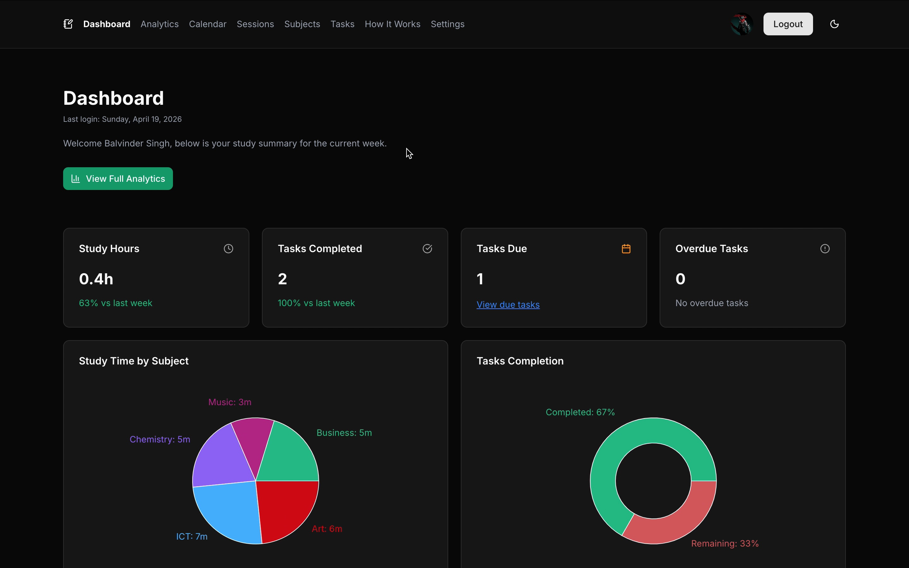

# The Smart Study Planner (Public)



## Overview

A full-stack web application to help students plan study sessions, track tasks, and visualize productivity trends. Demonstrates full-stack development, database modeling, authentication, state management, time-based tracking, and data visualization.

▶ **Live Demo:** https://thesmartstudyplanner.vercel.app

▶ **Video Demo:** https://www.youtube.com/watch?v=8CPBM40Zho4

---

## Tech Stack

- **Frontend:** Next.js, React, TypeScript, Shadcn UI, Tailwind CSS, React Hook Form, date-fns, Lucide icons, ZOD, Recharts, other libraries
- **Backend / Services:** Supabase (Authentication & Database)
- **Architecture:** Server-side and Client-side application
- **AI Tools:** ChatGPT was used as a helper to create and test certain things out.
- **Deployment:** Vercel

## Supabase Note

Email confirmation on register is disabled for this demo due to the free hosting setup. Password reset via email is also unavailable. Users however can still update their password in the settings page once logged in.

---

## Architecture

- Server-side and Client-side Next.js application
- Supabase used for authentication and database access
- Context components that manage authentication with server side checks aswell

---

## Key Features

### Authentication

- Email and password sign up / sign in
- Password update
- Session management handled by Supabase
- Persist auth state
- Protect app routes

### Dashboard

- Total study time (weekly)
- Tasks completed (weekly)
- Study time by Subject (chart)
- Upcoming Tasks
- KPI Cards showing additional data

### Analytics

- Total study time (7 days, 30 days, 90 days and 365 days)
- Study trend by Subject (chart)
- Study time by Subject (chart)
- KPI Cards showing additional data
- Study Session table with filters which show study time (7 days, 30 days, 90 days and 365 days)

### Calendar

- Displays due Tasks
- Displays overdue Tasks
- Displays completed Tasks
- Displays Study Sessions
- Displays total time studied

### Study Sessions

- Start / Pause / Stop timer
- Attach session to Subject
- Store duration

### Subjects

- Create / Edit / Delete
- Assign colour
- Filter Subjects with various filters
- Filters selected will change the URL

### Tasks

- Create / Edit / Delete
- Mark complete / incomplete
- Assign to Subject
- Due Date
- Filter Tasks with various filters
- Filters selected will change the URL

### User Profile

- Theme toggle (light/dark)
- Update name
- Update fontsize
- Update avatar
- Update password

---

## What I Learned

- Implementing secure authentication flows
- Managing complex UI state with complex data
- Used AI tools to help me create a large project 
- Designed, built and debugged a very large and complex project
- Integrating a backend-as-a-service into a server side and client side application
- Structuring a project for maintainability

---

## Source Code

The full source code for this project is kept in a **private repository**.

If you’re interested in reviewing the implementation, feel free to contact me.

---

```

## Author

**Balvinder Singh**

- 🔗 [LinkedIn](https://uk.linkedin.com/in/balvindersingh90)
- 🌐 [Portfolio](https://balvindersinghportfolio.netlify.app/)
